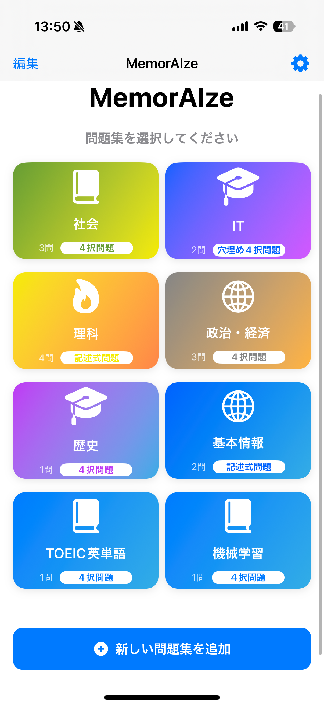
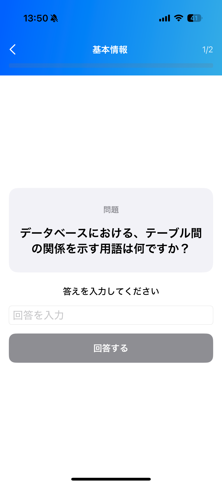
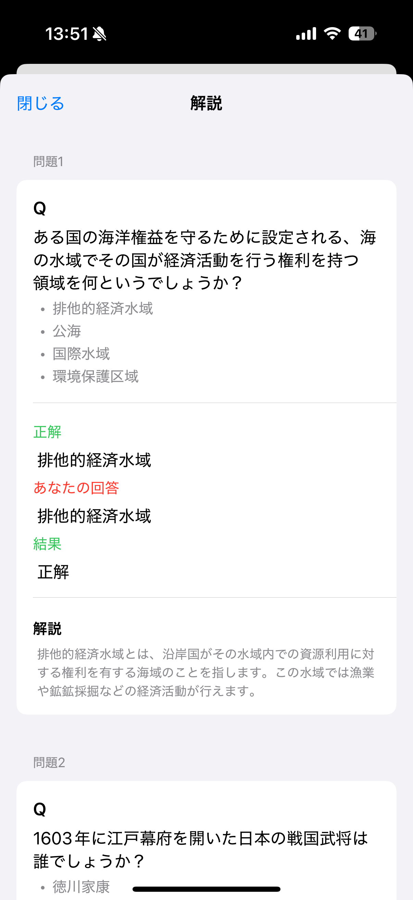

# 📱 MemorAIze

## 🌟 概要
このアプリは **複数の問題をAIが生成することで、さまざまな問題への対応力が得られる1問1答アプリ** です。  
ユーザーが **答えと問題を丸暗記して別の形式の問題に対応できない課題** をこのアプリ解決できるように設計されています。

---

## ✨ 主な機能
- ✅ **機能1**：覚えたい単語を入力することでそれに対する問題・解説をAIが生成してくれる
- ✅ **機能2**：1つの覚えたい単語に対して複数の問題を登録できる
- ✅ **機能3**：4択問題、記述問題、穴埋め問題に対応  
- ✅ **機能4**：AIが正しく問題を生成できているか別のAIで判断  

---

## 🛠 使用技術
- クライアントサイド: **SwiftUI**  
- サーバサイド: **Django**  
- データベース: **SwiftData**  
- インフラ: **Docker**  

---

## 📸 スクリーンショット
| アイコン | ホーム画面 | 問題集一覧画面 | 問題画面 | 解答解説画面 | 
|------------|-----------|-----------|-----------|-----------|
|  |  |  |  |  |

---

## 🚀 今後の展望
- 🔹 新機能追加（ファイルのテキストを抽出し、入力の手間を省く）  
- 🔹 UI/UX改善  
